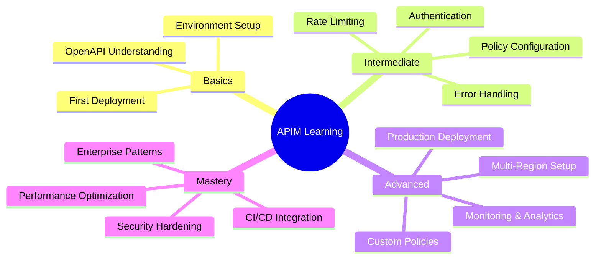

This project follows the Diátaxis framework for technical documentation. Our documentation is organized into four distinct types:

## 📚 Documentation Types

### 1. Tutorials (Learning-Oriented)
**Location:** `/docs/tutorials/`
- Getting started with Azure APIM
- Your first API deployment
- Understanding policies through examples

### 2. How-To Guides (Task-Oriented)
**Location:** `/docs/how-to/`
- How to deploy the Cars API
- How to test rate limiting
- How to implement JWT authentication
- How to debug policy errors

### 3. Reference (Information-Oriented)
**Location:** `/docs/reference/`
- API endpoints reference
- Policy reference guide
- Makefile commands reference
- Environment variables reference

### 4. Explanation (Understanding-Oriented)
**Location:** `/docs/explanation/`
- Why Azure API Management?
- Understanding rate limiting strategies
- CORS and web security explained
- RFC 9457 and error handling best practices

## 🗺️ Navigation Guide

### For Beginners
Start with **Tutorials** → Move to **How-To Guides** → Consult **Reference** as needed

### For Experienced Users
Jump to **How-To Guides** → Use **Reference** → Read **Explanations** for deeper understanding

### For Contributors
Read **Explanations** → Check **Reference** → Follow **How-To Guides** for contribution process

## 📁 Proposed File Structure

```
docs/
├── tutorials/
│   ├── 01-getting-started.md
│   ├── 02-first-deployment.md
│   └── 03-understanding-policies.md
├── how-to/
│   ├── deploy-api.md
│   ├── test-endpoints.md
│   ├── configure-authentication.md
│   ├── debug-policies.md
│   └── clean-up-resources.md
├── reference/
│   ├── api-endpoints.md
│   ├── makefile-commands.md
│   ├── environment-variables.md
│   ├── policy-reference.md
│   └── error-codes.md
├── explanation/
│   ├── why-azure-apim.md
│   ├── rate-limiting-explained.md
│   ├── security-headers.md
│   ├── rfc9457-benefits.md
│   └── architecture-overview.md
└── documentation-structure.md  # This file
```

## Learning Progression

The following mindmap shows how knowledge builds from basic concepts to mastery:



##   Content Guidelines

### Tutorials
- Complete, end-to-end learning experiences
- Assume no prior knowledge
- Focus on learning, not completing tasks
- Include context and explanations

### How-To Guides
- Specific, focused tasks
- Assume knowledge of the system
- Minimal explanations
- Clear prerequisites

### Reference
- Dry, factual information
- Structured for quick lookup
- Complete and accurate
- No explanations or tutorials

### Explanation
- Discuss concepts and background
- Provide context and reasoning
- Alternative approaches
- No step-by-step instructions
