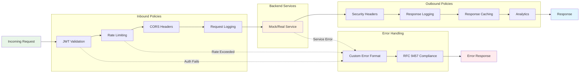

Azure API Management policies are the heart of how APIM processes every request and response. Understanding the execution pipeline is crucial for designing effective APIs and troubleshooting issues.

## Policy Execution Flow

Policies in APIM execute in a specific order, forming a pipeline that every request and response flows through:



## Policy Execution Stages

### 1. Inbound Policies
Executed **before** the request reaches your backend service:

#### JWT Validation
```xml
<validate-jwt header-name="Authorization" failed-validation-httpcode="401">
    <openid-config url="https://your-tenant.b2clogin.com/.well-known/openid-configuration" />
    <audiences>
        <audience>your-api-audience</audience>
    </audiences>
</validate-jwt>
```

#### Rate Limiting
```xml
<rate-limit calls="100" renewal-period="60" />
```

#### CORS Headers
```xml
<cors allow-credentials="false">
    <allowed-origins>
        <origin>https://your-frontend.com</origin>
    </allowed-origins>
    <allowed-methods>
        <method>GET</method>
        <method>POST</method>
    </allowed-methods>
</cors>
```

#### Request Logging
```xml
<log-to-eventhub>
    <message>Request: @(context.Request.Method) @(context.Request.Url)</message>
</log-to-eventhub>
```

### 2. Backend Service
The actual business logic - this could be:
- **Mock responses** (for testing/development)
- **Real microservices** (production backends)
- **Legacy systems** (modernization scenarios)

### 3. Outbound Policies
Executed **after** the backend responds, **before** returning to client:

#### Security Headers
```xml
<set-header name="X-Content-Type-Options" exists-action="override">
    <value>nosniff</value>
</set-header>
<set-header name="X-Frame-Options" exists-action="override">
    <value>DENY</value>
</set-header>
```

#### Response Logging
```xml
<log-to-eventhub>
    <message>Response: @(context.Response.StatusCode) in @(context.Elapsed.TotalMilliseconds)ms</message>
</log-to-eventhub>
```

#### Response Caching
```xml
<cache-store duration="3600" />
```

### 4. Error Handling (On-Error)
Executed when **any** policy fails or backend returns an error:

#### Custom Error Formatting
```xml
<return-response>
    <set-status code="@(context.Response.StatusCode)" reason="@(context.Response.StatusReason)" />
    <set-header name="Content-Type" exists-action="override">
        <value>application/problem+json</value>
    </set-header>
    <set-body>@{
        return new JObject(
            new JProperty("type", "https://example.com/problems/rate-limit-exceeded"),
            new JProperty("title", "Rate limit exceeded"),
            new JProperty("status", 429),
            new JProperty("detail", "You have exceeded the allowed number of requests")
        ).ToString();
    }</set-body>
</return-response>
```

## Policy Scopes and Inheritance

Policies can be applied at different levels, with inheritance flowing downward:

### 1. Global Scope
- Applied to **all APIs** in the APIM instance
- Typically used for: logging, security headers, monitoring

### 2. API Scope  
- Applied to **all operations** within a specific API
- Our Cars API uses this for: rate limiting, CORS, authentication

### 3. Operation Scope
- Applied to **specific endpoints** only
- Useful for: operation-specific caching, validation, transformation

### Policy Inheritance Example
```
Global Policy: Security headers for all APIs
    ↓
Cars API Policy: Rate limiting (100/min) + JWT validation
    ↓
GET /cars Operation: Response caching (1 hour)
```

## Common Policy Patterns

### Authentication Flow
```xml
<!-- Inbound: Validate subscription key or JWT -->
<choose>
    <when condition="@(context.Request.Headers.ContainsKey("Authorization"))">
        <validate-jwt header-name="Authorization" />
    </when>
    <otherwise>
        <check-header name="Ocp-Apim-Subscription-Key" failed-check-httpcode="401" />
    </otherwise>
</choose>
```

### Rate Limiting with Custom Messages
```xml
<rate-limit calls="100" renewal-period="60" 
           remaining-calls-header-name="X-RateLimit-Remaining"
           total-calls-header-name="X-RateLimit-Limit"
           renewal-period-header-name="X-RateLimit-Reset" />
```

### Backend Routing
```xml
<choose>
    <when condition="@(context.Request.Url.Path.Contains("/v1/"))">
        <set-backend-service base-url="https://api-v1.example.com" />
    </when>
    <when condition="@(context.Request.Url.Path.Contains("/v2/"))">
        <set-backend-service base-url="https://api-v2.example.com" />
    </when>
    <otherwise>
        <mock-response status-code="404" content-type="application/problem+json" />
    </otherwise>
</choose>
```

## Policy Debugging Tips

### 1. Use Trace for Development
```xml
<trace source="my-api">
    <message>Request processed at @(DateTime.UtcNow)</message>
    <metadata name="userId" value="@(context.Request.Headers.GetValueOrDefault("X-User-Id"))" />
</trace>
```

### 2. Log Context Variables
```xml
<log-to-eventhub>
    <message>@{
        return new JObject(
            new JProperty("requestId", context.RequestId),
            new JProperty("method", context.Request.Method),
            new JProperty("url", context.Request.Url.ToString()),
            new JProperty("userAgent", context.Request.Headers.GetValueOrDefault("User-Agent"))
        ).ToString();
    }</message>
</log-to-eventhub>
```

### 3. Test with Mock Responses
```xml
<mock-response status-code="200" content-type="application/json">
    <![CDATA[{
        "debug": {
            "requestId": "@(context.RequestId)",
            "timestamp": "@(DateTime.UtcNow)",
            "elapsed": "@(context.Elapsed.TotalMilliseconds)ms"
        }
    }]]>
</mock-response>
```

## Performance Considerations

### Policy Execution Cost
1. **JWT Validation** - Cryptographic operations (moderate cost)
2. **Database Lookups** - External calls (high cost)
3. **Simple Transforms** - In-memory operations (low cost)
4. **Logging** - I/O operations (low-moderate cost)

### Optimization Strategies
- **Cache** expensive lookups using `<cache-lookup>` and `<cache-store>`
- **Minimize** external service calls in policies
- **Use** `<choose>` conditions to skip unnecessary processing
- **Place** expensive policies after cheaper validation policies

## Error Handling Best Practices

### 1. Always Handle Policy Failures
```xml
<on-error>
    <base />
    <set-header name="X-Error-Source" exists-action="override">
        <value>APIM-Policy</value>
    </set-header>
    <return-response>
        <set-status code="500" reason="Internal Server Error" />
        <set-body>@{
            return JsonConvert.SerializeObject(new {
                type = "https://example.com/problems/policy-error",
                title = "Policy execution failed",
                status = 500,
                instance = context.RequestId
            });
        }</set-body>
    </return-response>
</on-error>
```

### 2. Provide Meaningful Error Messages
- Include **request ID** for troubleshooting
- Use **RFC 9457** problem details format
- Add **correlation headers** for distributed tracing

## Next Steps

- **Learn Policy Syntax**: Review [Azure APIM Policy Reference](https://docs.microsoft.com/azure/api-management/api-management-policies)
- **Practice with Examples**: Try [Common Policy Patterns](../how-to/common-policies.md)
- **Debug Policies**: Use [APIM Testing Tools](../how-to/debug-policies.md)
- **Production Policies**: Implement [Security Best Practices](../how-to/security-policies.md)

Understanding policy execution is key to leveraging APIM's full power for security, transformation, and observability.