Welcome to your journey with Azure API Management! This tutorial will guide you through understanding what Azure API Management is and preparing your environment for your first API deployment.

## What You'll Learn

By the end of this tutorial, you will:

- Understand what Azure API Management is and why it's useful
- Have all the necessary tools installed
- Have an Azure account ready
- Understand the project structure
- Be ready to deploy your first API

```mermaid
graph TD
    Start([Start Learning]) --> Setup[Environment Setup<br/>Azure CLI, Node.js, Make]
    Setup --> Clone[Clone Repository<br/>apim-learn project]
    Clone --> Config[Configure Environment<br/>Copy .env.example → .env]
    
    Config --> Choice{Choose Path}
    
    Choice -->|Quick Start| Mock[Deploy Mock API<br/>make deploy-mock]
    Choice -->|Full Setup| Azure[Create Azure Resources<br/>Resource Group + APIM]
    
    Azure --> Deploy[Deploy Real API<br/>make deploy]
    Mock --> Test1[Test Endpoints<br/>make test-list-cars]
    Deploy --> Test2[Test Endpoints<br/>make test-get-car]
    
    Test1 --> Explore[Explore Features]
    Test2 --> Explore
    
    Explore --> Policies[Understand Policies<br/>Rate Limiting, Security]
    Policies --> RFC[RFC 9457 Errors<br/>Structured Error Handling]
    RFC --> Advanced[Advanced Topics<br/>Custom Policies, Monitoring]
    
    Advanced --> Mastery[APIM Mastery<br/>Production Ready!]
    
    style Start fill:#e8f5e8
    style Mock fill:#fff3e0
    style Deploy fill:#e1f5fe
    style Mastery fill:#f3e5f5
```



## Prerequisites

This tutorial assumes:

- Basic familiarity with command line/terminal
- Basic understanding of APIs and HTTP
- No prior Azure or API Management experience

## Part 1: Understanding Azure API Management

### What is Azure API Management?

Azure API Management (APIM) is like a smart doorway for your APIs. Imagine you have a house (your backend services) and you want to control who comes in, when they can visit, and what rooms they can access. APIM is that smart doorway.

It provides:

- **Security**: Who can access your APIs
- **Traffic Control**: How many requests are allowed
- **Transformation**: Modify requests and responses
- **Analytics**: See how your APIs are being used

### Our Learning Project: Fast & Furious Cars API

We'll deploy a fun API about cars from the Fast & Furious movies. This isn't just a "Hello World" - it includes:

- Real rate limiting
- Security headers
- Error handling
- Response caching

## Part 2: Setting Up Your Environment

### Step 1: Install Required Tools

Let's install everything you'll need. Open your terminal:

#### For macOS

```bash
# Install Homebrew if you don't have it
/bin/bash -c "$(curl -fsSL https://raw.githubusercontent.com/Homebrew/install/HEAD/install.sh)"

# Install Azure CLI
brew update && brew install azure-cli

# Install Node.js (includes npm)
brew install node

# Verify installations
az --version
node --version
npm --version
make --version  # Should already be installed on macOS
```

#### For Windows

```bash
# Install Chocolatey package manager first
# Run PowerShell as Administrator
Set-ExecutionPolicy Bypass -Scope Process -Force
[System.Net.ServicePointManager]::SecurityProtocol = [System.Net.ServicePointManager]::SecurityProtocol -bor 3072
iex ((New-Object System.Net.WebClient).DownloadString('https://community.chocolatey.org/install.ps1'))

# Install required tools
choco install azure-cli nodejs make

# Verify installations
az --version
node --version
npm --version
make --version
```

#### For Linux (Ubuntu/Debian)

```bash
# Update package index
sudo apt-get update

# Install Azure CLI
curl -sL https://aka.ms/InstallAzureCLIDeb | sudo bash

# Install Node.js
curl -fsSL https://deb.nodesource.com/setup_lts.x | sudo -E bash -
sudo apt-get install -y nodejs

# Install Make
sudo apt-get install -y build-essential

# Verify installations
az --version
node --version
npm --version
make --version
```

### Step 2: Set Up Your Azure Account

1. **Create a Free Azure Account**
   - Go to <https://azure.microsoft.com/free/>
   - Click "Start free"
   - Follow the sign-up process (requires credit card for verification, but won't be charged)

2. **Log in to Azure CLI**

   ```bash
   az login
   ```

   This will open your browser. Log in with your Azure account.

3. **Verify Your Subscription**

   ```bash
   az account show
   ```

   You should see your subscription details.

### Step 3: Clone and Explore the Project

1. **Clone the Repository**

   ```bash
   git clone https://github.com/yourusername/apim-learn.git
   cd apim-learn
   ```

2. **Explore the Structure**

   ```bash
   tree -L 2  # or use 'ls -la' if tree isn't installed
   ```

   You'll see:
   - `openapi/` - Contains our API definition
   - `policies/` - Security and traffic rules
   - `Makefile` - Automation commands
   - `.env.example` - Configuration template

3. **Install Project Dependencies**

   ```bash
   make install
   ```

   This installs tools for checking our API definition quality.

### Step 4: Configure Your Environment

1. **Create Your Configuration File**

   ```bash
   cp .env.example .env
   ```

2. **Edit the .env File**
   Open `.env` in your favorite text editor:

   ```bash
   # macOS
   open -e .env
   
   # Windows
   notepad .env
   
   # Linux
   nano .env
   ```

3. **Update with Your Values**
   For now, keep the default values. We'll create the actual Azure resources in the next tutorial.

### Step 5: Retrieve Subscription Keys

After creating your APIM instance, you need to retrieve the subscription keys:

```bash
# Get master subscription keys
make get-keys
```

Add the displayed keys to your `.env` file:

```bash
APIM_PRIMARY_KEY=<your-primary-key>
APIM_SECONDARY_KEY=<your-secondary-key>
```

These keys are required for API authentication and testing.

## Part 3: Understanding the Project

### What We're Building

The Fast & Furious Cars API is a mock API that:

- Lists all cars from the movies
- Gets details about specific cars
- Includes rate limiting (100 requests/minute)
- Has security headers
- Returns proper error messages

### Key Concepts We'll Learn

1. **API Gateway Pattern**: How APIM sits between users and your services
2. **Policies**: Rules that run before and after API calls
3. **Rate Limiting**: Preventing API abuse
4. **Security**: Authentication and authorization
5. **Mock APIs**: Testing without a real backend

## Part 4: Verify Everything Works

Run our verification command:

```bash
make env-check
```

You should see:

```bash
🔍 Checking required env vars...
✅ All required env vars set
   RG=rg-apim-fast
   APIM=apim-fast-demo
   API_ID=cars-api
```

## What's Next?

Congratulations! You now have:

- ✅ All tools installed
- ✅ Azure account ready
- ✅ Project set up
- ✅ Understanding of what we're building

**Next Steps:**

1. **[Provision Azure Resources](02-provision-azure-resources.md)** - Create your Resource Group and APIM instance (15-45 minutes)
2. **[Deploy Your First API](03-first-deployment.md)** - Deploy the Cars API to your new APIM instance

## Troubleshooting

### "Command not found" errors

Make sure you've restarted your terminal after installations.

### Azure login issues

Try `az logout` then `az login` again.

### Make command not working on Windows

Use Git Bash or WSL (Windows Subsystem for Linux) instead of Command Prompt.

## Further Reading

- [What is Azure API Management?](../explanation/why-azure-apim.md)
- [Understanding the Project Architecture](../explanation/architecture-overview.md)

---

**Ready to provision your Azure resources?** Continue to [Provision Azure Resources →](02-provision-azure-resources.md)
