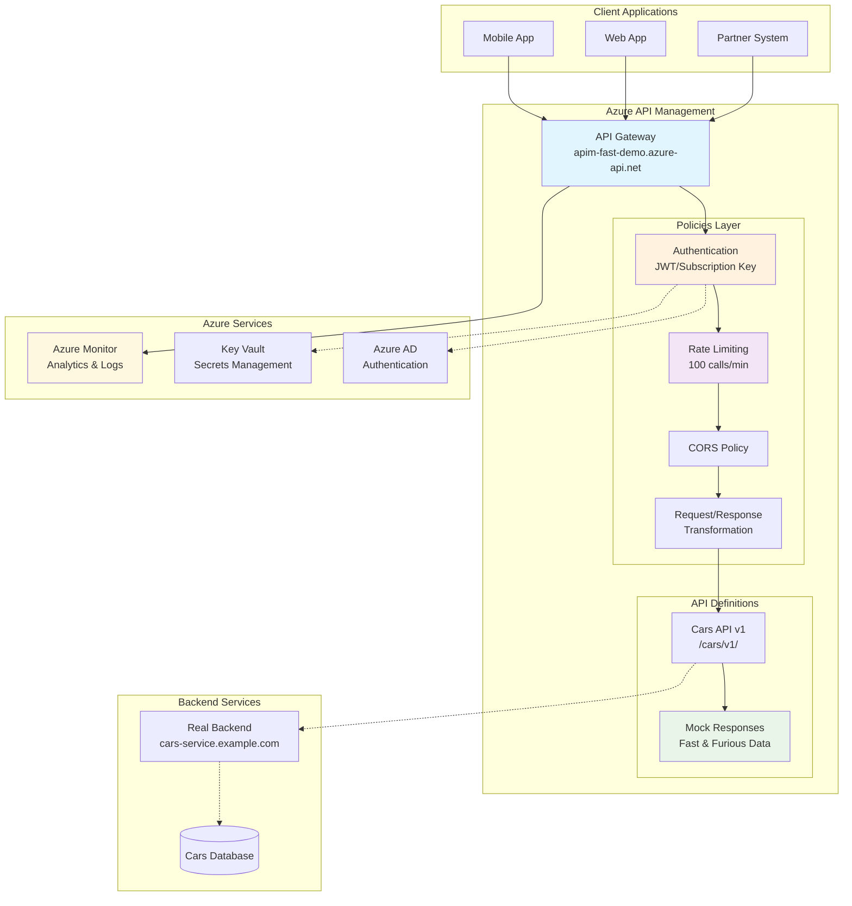

This document provides a comprehensive view of how Azure API Management fits into your overall architecture, including client applications, backend services, and Azure ecosystem integration.

## System Architecture

The following diagram shows the complete Azure API Management architecture and how all components work together:



## Architecture Components

### Client Layer
- **Mobile Apps** - iOS, Android applications consuming your APIs
- **Web Applications** - Single-page applications, websites
- **Partner Systems** - Third-party integrations, B2B connections

### API Management Layer
The core of your API strategy, providing:

#### Gateway (Entry Point)
- Single endpoint for all API consumers
- SSL termination and security
- Request routing and load balancing
- Consumption tier auto-scaling

#### Policies Layer
Executed in sequence for every request:
1. **Authentication** - JWT validation or subscription key verification
2. **Rate Limiting** - Prevent API abuse (100 calls/minute in our example)
3. **CORS** - Cross-origin resource sharing for web clients
4. **Transformation** - Modify requests/responses as needed

#### API Definitions
- **OpenAPI Specifications** - Define your API contracts
- **Mock Responses** - Test without backend implementation
- **Versioning** - Manage API evolution without breaking clients

### Backend Layer
- **Real Services** - Your actual business logic and data processing
- **Databases** - Data persistence layer
- **Microservices** - Distributed service architecture

### Azure Integration
- **Azure AD** - Centralized authentication and authorization
- **Azure Monitor** - Logging, metrics, and alerting
- **Key Vault** - Secure secrets and certificate management

## Data Flow

### Typical Request Flow
1. **Client** sends request to APIM Gateway URL
2. **Authentication Policy** validates subscription key or JWT
3. **Rate Limiting Policy** checks request quota
4. **CORS Policy** adds appropriate headers for web clients
5. **Transformation Policy** modifies request if needed
6. **API Definition** routes to appropriate backend or mock
7. **Response** flows back through outbound policies

### Error Handling
- Failed authentication → 401 Unauthorized
- Rate limit exceeded → 429 Too Many Requests
- Backend errors → Transformed to RFC 9457 format
- All errors include structured problem details

## Architecture Benefits

### For Development Teams
- **Consistency** - All APIs follow same patterns
- **Security** - Centralized authentication and authorization
- **Observability** - Unified logging and monitoring
- **Testing** - Mock responses enable frontend development

### For Operations Teams
- **Scalability** - Auto-scaling with Consumption tier
- **Reliability** - Built-in retry and circuit breaker patterns
- **Monitoring** - Integration with Azure Monitor
- **Security** - Managed security updates and patches

### for Business
- **Time to Market** - Faster API deployment and iteration
- **Partner Onboarding** - Self-service developer portal
- **Analytics** - API usage insights and business metrics
- **Compliance** - Built-in security and audit capabilities

## Deployment Patterns

### Development Environment
```
Developer Workstation → APIM (Consumption) → Mock Backends
```

### Staging Environment
```
Test Clients → APIM (Consumption) → Real Backends (Test Data)
```

### Production Environment
```
Production Clients → APIM (Standard/Premium) → Production Backends
```

## Next Steps

- **Understand Policies**: Learn how [Policy Execution](policy-execution.md) works
- **Monitor Your APIs**: Set up [Azure Monitor Integration](../how-to/monitoring.md)
- **Scale for Production**: Review [Production Deployment Patterns](../how-to/production-deployment.md)

This architecture provides a solid foundation for API management that can grow with your needs, from learning and development through to enterprise-scale production deployments.