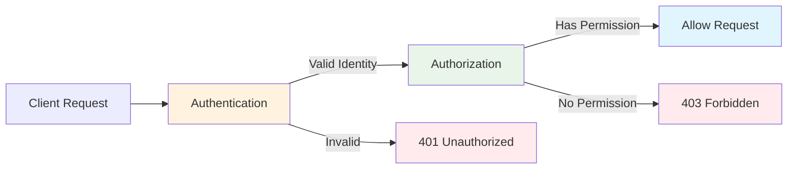
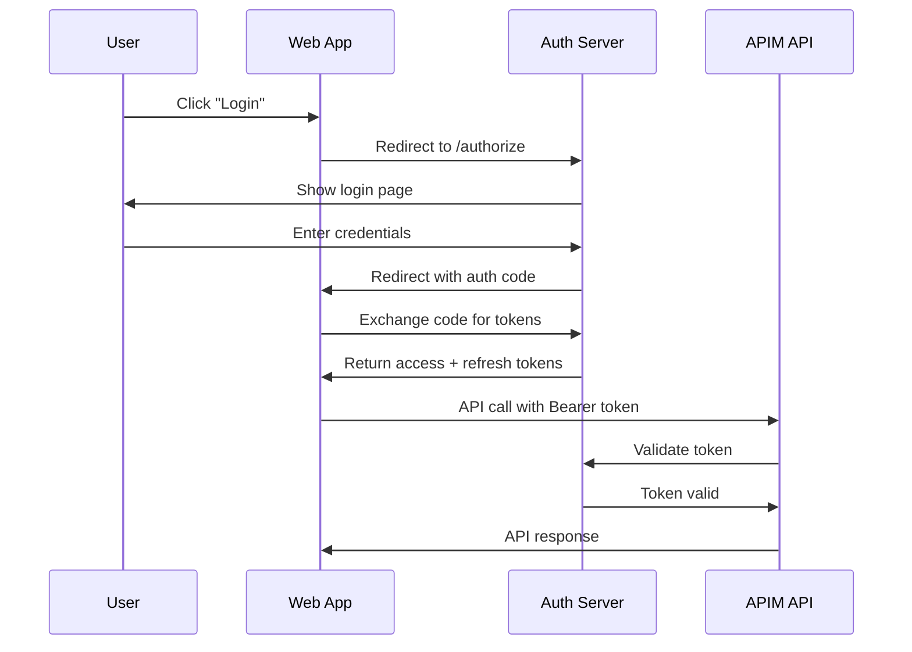
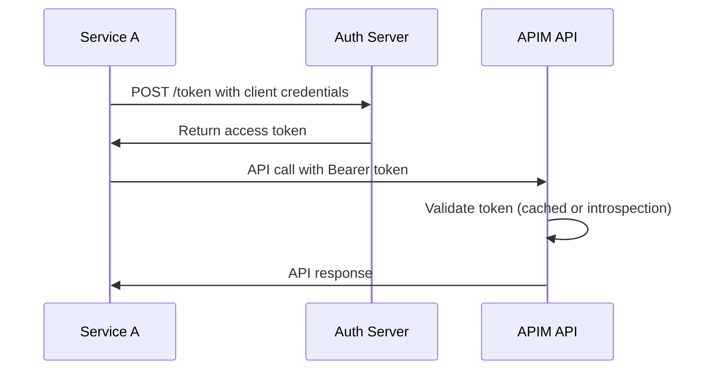

Authentication and authorization are fundamental security concepts in API management. This guide provides a deep understanding of how these mechanisms work in Azure API Management and when to use each approach.

## Authentication vs Authorization

Understanding the distinction is crucial for implementing proper API security:

| Concept | Purpose | Question Answered | Example |
|---------|---------|-------------------|---------|
| **Authentication** | Identity verification | "Who are you?" | User provides valid credentials |
| **Authorization** | Permission checking | "What can you do?" | User has 'read' role for cars data |



## Authentication Methods in APIM

### 1. Subscription Keys

**Best for**: Internal APIs, service-to-service communication, simple authentication

```xml
<!-- Subscription key validation -->
<check-header name="Ocp-Apim-Subscription-Key" 
              failed-check-httpcode="401" 
              failed-check-error-message="Subscription key required" />
```

**Characteristics**:
- ✅ Simple to implement
- ✅ Built into APIM
- ✅ Good for internal services
- ❌ No user context
- ❌ Limited security (shared secrets)
- ❌ Difficult to rotate

**Usage Example**:
```bash
curl -H "Ocp-Apim-Subscription-Key: abc123" \
  "https://api.example.com/cars"
```

### 2. JWT (JSON Web Tokens)

**Best for**: User-facing APIs, mobile apps, web applications

```xml
<!-- JWT validation with Azure AD -->
<validate-jwt header-name="Authorization" failed-validation-httpcode="401">
    <openid-config url="https://login.microsoftonline.com/{tenant}/v2.0/.well-known/openid-configuration" />
    <audiences>
        <audience>api://your-api</audience>
    </audiences>
    <required-claims>
        <claim name="roles" match="any">
            <value>api.read</value>
            <value>api.write</value>
        </claim>
    </required-claims>
</validate-jwt>
```

**Characteristics**:
- ✅ Industry standard (RFC 7519)
- ✅ Contains user context and claims
- ✅ Stateless and scalable
- ✅ Self-contained (no database lookups)
- ❌ More complex setup
- ❌ Token size overhead

### 3. Client Certificates

**Best for**: B2B APIs, high-security scenarios, machine-to-machine

```xml
<!-- Client certificate validation -->
<validate-client-certificate certificate-id="my-cert" />
<!-- Or validate specific properties -->
<validate-client-certificate 
    validate-revocation="true" 
    validate-trust="true" 
    validate-not-before="true" 
    validate-not-after="true" />
```

**Characteristics**:
- ✅ Highest security level
- ✅ Mutual authentication
- ✅ Non-repudiation
- ❌ Complex certificate management
- ❌ Difficult for web/mobile clients

### 4. OAuth 2.0 / OpenID Connect

**Best for**: Third-party integrations, delegated access, social logins

```xml
<!-- OAuth token introspection -->
<send-request mode="new" response-variable-name="tokenvalidation" timeout="10" ignore-error="false">
    <set-url>https://oauth-provider.com/introspect</set-url>
    <set-method>POST</set-method>
    <set-header name="Content-Type" exists-action="override">
        <value>application/x-www-form-urlencoded</value>
    </set-header>
    <set-body>@{
        return "token=" + context.Request.Headers.GetValueOrDefault("Authorization","").Replace("Bearer ","");
    }</set-body>
</send-request>

<choose>
    <when condition="@(((IResponse)context.Variables["tokenvalidation"]).Body.As<JObject>()["active"].Value<bool>() == false)">
        <return-response>
            <set-status code="401" reason="Unauthorized" />
        </return-response>
    </when>
</choose>
```

## JWT Deep Dive

### JWT Structure

A JWT consists of three parts separated by dots:

```
eyJ0eXAiOiJKV1QiLCJhbGciOiJSUzI1NiJ9.eyJzdWIiOiIxMjM0NTY3ODkwIiwibmFtZSI6IkpvaG4gRG9lIiwiYWRtaW4iOnRydWV9.signature
|------------- Header -------------||----- Payload -----||- Signature -|
```

#### Header
```json
{
  "typ": "JWT",
  "alg": "RS256",
  "kid": "key-id-123"
}
```

#### Payload (Claims)
```json
{
  "iss": "https://login.microsoftonline.com/tenant-id/v2.0",
  "aud": "api://your-api",
  "sub": "user-id-123",
  "exp": 1640995200,
  "iat": 1640991600,
  "roles": ["api.read", "api.write"],
  "email": "user@example.com",
  "name": "John Doe"
}
```

### Standard JWT Claims

| Claim | Name | Purpose | Example |
|-------|------|---------|---------|
| `iss` | Issuer | Who issued the token | `https://login.microsoftonline.com/tenant/v2.0` |
| `sub` | Subject | User identifier | `user-id-123` |
| `aud` | Audience | Intended recipient | `api://your-api` |
| `exp` | Expiration | When token expires | `1640995200` (Unix timestamp) |  
| `iat` | Issued At | When token was issued | `1640991600` |
| `nbf` | Not Before | Token not valid before | `1640991600` |
| `jti` | JWT ID | Unique token identifier | `abc-123-def` |

### Custom Claims

```json
{
  "roles": ["admin", "user"],
  "permissions": ["read:cars", "write:cars"],
  "tenant_id": "company-abc",
  "subscription_type": "premium"
}
```

### JWT Validation in APIM

```xml
<validate-jwt header-name="Authorization" failed-validation-httpcode="401">
    <!-- Discover signing keys automatically -->
    <openid-config url="https://login.microsoftonline.com/{tenant}/v2.0/.well-known/openid-configuration" />
    
    <!-- Validate audience -->
    <audiences>
        <audience>api://cars-api</audience>
        <audience>https://api.example.com</audience>
    </audiences>
    
    <!-- Validate issuer -->
    <issuers>
        <issuer>https://login.microsoftonline.com/{tenant}/v2.0</issuer>
    </issuers>
    
    <!-- Require specific claims -->
    <required-claims>
        <claim name="roles" match="any">
            <value>api.read</value>
            <value>api.write</value>
        </claim>
        <claim name="email" match="any">
            <value>.*@company\.com</value>
        </claim>
    </required-claims>
</validate-jwt>
```

## Authorization Patterns

### 1. Role-Based Access Control (RBAC)

Users are assigned roles, roles have permissions:

```xml
<!-- Extract user roles from JWT -->
<set-variable name="userRoles" value="@{
    if(context.Variables.ContainsKey("validated-jwt")) {
        var jwt = (Jwt)context.Variables["validated-jwt"];
        return jwt.Claims.GetValueOrDefault("roles", "").Split(',');
    }
    return new string[0];
}" />

<!-- Check for admin role -->
<choose>
    <when condition="@(((string[])context.Variables["userRoles"]).Contains("admin"))">
        <!-- Admin can access everything -->
        <set-header name="X-Access-Level" exists-action="override">
            <value>admin</value>
        </set-header>
    </when>
    <when condition="@(((string[])context.Variables["userRoles"]).Contains("user"))">
        <!-- Users can only read -->
        <choose>
            <when condition="@(context.Request.Method != "GET")">
                <return-response>
                    <set-status code="403" reason="Forbidden" />
                    <set-body>{"error": "Read-only access"}</set-body>
                </return-response>
            </when>
        </choose>
    </when>
    <otherwise>
        <return-response>
            <set-status code="403" reason="Forbidden" />
            <set-body>{"error": "No valid role found"}</set-body>
        </return-response>
    </otherwise>
</choose>
```

### 2. Attribute-Based Access Control (ABAC)

Fine-grained access based on multiple attributes:

```xml
<!-- ABAC policy example -->
<choose>
    <when condition="@{
        if(!context.Variables.ContainsKey("validated-jwt")) return false;
        
        var jwt = (Jwt)context.Variables["validated-jwt"];
        var userDepartment = jwt.Claims.GetValueOrDefault("department", "");
        var userLevel = jwt.Claims.GetValueOrDefault("level", "");
        var requestedResource = context.Request.Url.Path;
        var currentHour = DateTime.UtcNow.Hour;
        
        // Complex authorization logic
        return (userDepartment == "Finance" && userLevel == "Senior" && requestedResource.Contains("/financial/")) ||
               (userDepartment == "HR" && currentHour >= 9 && currentHour <= 17) ||
               (userLevel == "Executive");
    }">
        <!-- Access granted -->
    </when>
    <otherwise>
        <return-response>
            <set-status code="403" reason="Forbidden" />
            <set-body>{"error": "Access denied based on policy"}</set-body>
        </return-response>
    </otherwise>
</choose>
```

### 3. Resource-Based Access Control

Access based on resource ownership:

```xml
<!-- Extract resource owner from URL -->
<set-variable name="resourceOwner" value="@{
    var pathSegments = context.Request.Url.Path.Split('/');
    // URL pattern: /users/{userId}/cars/{carId}
    return pathSegments.Length > 2 ? pathSegments[2] : "";
}" />

<!-- Check if user owns the resource -->
<choose>
    <when condition="@{
        if(!context.Variables.ContainsKey("validated-jwt")) return false;
        
        var jwt = (Jwt)context.Variables["validated-jwt"];
        var currentUser = jwt.Claims.GetValueOrDefault("sub", "");
        var resourceOwner = (string)context.Variables["resourceOwner"];
        
        return currentUser == resourceOwner;
    }">
        <!-- User owns the resource -->
    </when>
    <otherwise>
        <return-response>
            <set-status code="403" reason="Forbidden" />
            <set-body>{"error": "You can only access your own resources"}</set-body>
        </return-response>
    </otherwise>
</choose>
```

## OAuth 2.0 Flows

### 1. Authorization Code Flow

**Best for**: Web applications with server-side code



### 2. Client Credentials Flow

**Best for**: Service-to-service communication



### 3. Implicit Flow (Deprecated)

**Previously used for**: Single-page applications (now use Authorization Code + PKCE)

### 4. Authorization Code + PKCE Flow

**Best for**: Mobile apps, single-page applications

```xml
<!-- PKCE validation example -->
<validate-jwt header-name="Authorization">
    <openid-config url="https://login.microsoftonline.com/{tenant}/v2.0/.well-known/openid-configuration" />
    <audiences>
        <audience>api://mobile-app</audience>
    </audiences>
    <required-claims>
        <claim name="auth_method" match="any">
            <value>PKCE</value>
        </claim>
    </required-claims>
</validate-jwt>
```

## Security Best Practices

### 1. Token Validation

```xml
<!-- Comprehensive JWT validation -->
<validate-jwt header-name="Authorization" 
              failed-validation-httpcode="401"
              failed-validation-error-message="Invalid or expired token"
              require-expiration-time="true"
              require-signed-tokens="true"
              clock-skew="300">
    
    <openid-config url="https://login.microsoftonline.com/{tenant}/v2.0/.well-known/openid-configuration" />
    
    <!-- Validate all critical claims -->
    <audiences>
        <audience>api://your-api</audience>
    </audiences>
    
    <issuers>
        <issuer>https://login.microsoftonline.com/{tenant}/v2.0</issuer>
    </issuers>
    
    <!-- Ensure tokens are fresh -->
    <required-claims>
        <claim name="iat" match="any">
            <!-- Token must be issued within last hour -->
            <value>@(DateTimeOffset.UtcNow.AddHours(-1).ToUnixTimeSeconds())</value>
        </claim>
    </required-claims>
</validate-jwt>
```

### 2. Rate Limiting by User

```xml
<!-- Different rate limits based on user tier -->
<choose>
    <when condition="@{
        if(!context.Variables.ContainsKey("validated-jwt")) return false;
        var jwt = (Jwt)context.Variables["validated-jwt"];
        return jwt.Claims.GetValueOrDefault("tier", "") == "premium";
    }">
        <rate-limit calls="1000" renewal-period="60" counter-key="@(((Jwt)context.Variables["validated-jwt"]).Claims["sub"])" />
    </when>
    <otherwise>
        <rate-limit calls="100" renewal-period="60" counter-key="@(((Jwt)context.Variables["validated-jwt"]).Claims["sub"])" />
    </otherwise>
</choose>
```

### 3. Token Caching

```xml
<!-- Cache JWT validation results -->
<cache-lookup vary-by-developer="false" vary-by-developer-groups="false" downstream-caching-type="none">
    <vary-by-header>Authorization</vary-by-header>
</cache-lookup>

<choose>
    <when condition="@(!context.Variables.ContainsKey("cached-jwt-validation"))">
        <!-- Perform JWT validation -->
        <validate-jwt header-name="Authorization">
            <!-- JWT validation config -->
        </validate-jwt>
        
        <!-- Cache the result for 5 minutes -->  
        <cache-store duration="300" />
    </when>
</choose>
```

### 4. Secure Headers

```xml
<!-- Add security headers for authenticated requests -->
<set-header name="Strict-Transport-Security" exists-action="override">
    <value>max-age=31536000; includeSubDomains</value>
</set-header>

<set-header name="X-Content-Type-Options" exists-action="override">
    <value>nosniff</value>
</set-header>

<set-header name="X-Frame-Options" exists-action="override">
    <value>DENY</value>
</set-header>

<!-- Add user context headers -->
<choose>
    <when condition="@(context.Variables.ContainsKey("validated-jwt"))">
        <set-header name="X-User-ID" exists-action="override">
            <value>@(((Jwt)context.Variables["validated-jwt"]).Claims.GetValueOrDefault("sub", ""))</value>
        </set-header>
        <set-header name="X-User-Roles" exists-action="override">
            <value>@(((Jwt)context.Variables["validated-jwt"]).Claims.GetValueOrDefault("roles", ""))</value>
        </set-header>
    </when>
</choose>
```

## Common Authentication Patterns

### 1. Hybrid Authentication

Support multiple authentication methods:

```xml
<choose>
    <!-- Try JWT first -->
    <when condition="@(context.Request.Headers.ContainsKey("Authorization"))">
        <validate-jwt header-name="Authorization">
            <!-- JWT config -->
        </validate-jwt>
        <set-variable name="auth-method" value="jwt" />
    </when>
    
    <!-- Fallback to subscription key -->
    <when condition="@(context.Request.Headers.ContainsKey("Ocp-Apim-Subscription-Key"))">
        <check-header name="Ocp-Apim-Subscription-Key" failed-check-httpcode="401" />
        <set-variable name="auth-method" value="subscription-key" />
    </when>
    
    <!-- No valid authentication -->
    <otherwise>
        <return-response>
            <set-status code="401" reason="Unauthorized" />
            <set-body>{"error": "No valid authentication provided"}</set-body>
        </return-response>
    </otherwise>
</choose>
```

### 2. API Key + JWT

Require both API key and user token:

```xml
<!-- Validate API key first -->
<check-header name="X-API-Key" failed-check-httpcode="401" failed-check-error-message="API key required" />

<!-- Then validate user JWT -->
<validate-jwt header-name="Authorization">
    <!-- JWT config -->
</validate-jwt>

<!-- Both required for access -->
<set-header name="X-Auth-Method" exists-action="override">
    <value>api-key+jwt</value>
</set-header>
```

### 3. Conditional Authentication

Different auth requirements based on operation:

```xml
<choose>
    <!-- Public endpoints (no auth required) -->
    <when condition="@(context.Request.Url.Path.Contains("/public/"))">
        <!-- No authentication required -->
        <set-header name="X-Access-Type" exists-action="override">
            <value>public</value>
        </set-header>
    </when>
    
    <!-- Admin endpoints (require JWT with admin role) -->
    <when condition="@(context.Request.Url.Path.Contains("/admin/"))">
        <validate-jwt header-name="Authorization">
            <!-- JWT config -->
            <required-claims>
                <claim name="roles" match="any">
                    <value>admin</value>
                </claim>
            </required-claims>
        </validate-jwt>
    </when>
    
    <!-- Regular endpoints (any valid auth) -->
    <otherwise>
        <choose>
            <when condition="@(context.Request.Headers.ContainsKey("Authorization"))">
                <validate-jwt header-name="Authorization">
                    <!-- JWT config -->
                </validate-jwt>
            </when>
            <otherwise>
                <check-header name="Ocp-Apim-Subscription-Key" failed-check-httpcode="401" />
            </otherwise>
        </choose>
    </otherwise>
</choose>
```

## Troubleshooting Authentication Issues

### Common Problems and Solutions

| Issue | Symptoms | Solution |
|-------|----------|----------|
| **Token Expired** | 401 with "expired" message | Refresh token or get new one |
| **Wrong Audience** | 401 with "invalid audience" | Check `aud` claim in token |
| **Clock Skew** | Intermittent 401 errors | Increase clock-skew tolerance |
| **Missing Claims** | 403 forbidden | Check required-claims configuration |
| **Key Rotation** | Sudden auth failures | Update OpenID config URL |

### Debug Authentication

```xml
<!-- Debug authentication state -->
<trace source="auth-debug">
    <message>Authentication Debug: @{
        var hasAuth = context.Request.Headers.ContainsKey("Authorization");
        var hasSubKey = context.Request.Headers.ContainsKey("Ocp-Apim-Subscription-Key");
        var hasJWT = context.Variables.ContainsKey("validated-jwt");
        
        return new JObject(
            new JProperty("hasAuthHeader", hasAuth),
            new JProperty("hasSubscriptionKey", hasSubKey),
            new JProperty("hasValidJWT", hasJWT),
            new JProperty("authHeader", hasAuth ? context.Request.Headers["Authorization"].FirstOrDefault() : "none")
        ).ToString();
    }</message>
</trace>
```

## What's Next?

You now have a deep understanding of authentication and authorization in APIM! Continue your learning:

1. **🏭 [Production-Ready APIs](/tutorials/04-production-ready-apis/)** - Apply these concepts in production
2. **📊 [Monitor API Performance](/how-to/monitor-api-performance/)** - Track authentication metrics
3. **🔐 [Security Best Practices](/explanation/security-best-practices/)** - Advanced security patterns
4. **🎯 [API Design Patterns](/explanation/api-design-patterns/)** - Design secure APIs

## Summary

This deep dive covered:

- ✅ **Authentication vs Authorization** - Core concepts and differences
- ✅ **Authentication Methods** - Subscription keys, JWT, certificates, OAuth
- ✅ **JWT Deep Dive** - Structure, claims, validation
- ✅ **Authorization Patterns** - RBAC, ABAC, resource-based access
- ✅ **OAuth 2.0 Flows** - Different flows for different scenarios
- ✅ **Security Best Practices** - Token validation, caching, headers
- ✅ **Common Patterns** - Hybrid auth, conditional requirements
- ✅ **Troubleshooting** - Debug techniques and common issues

Understanding these concepts enables you to build secure, scalable APIs that properly authenticate users and authorize access to resources.