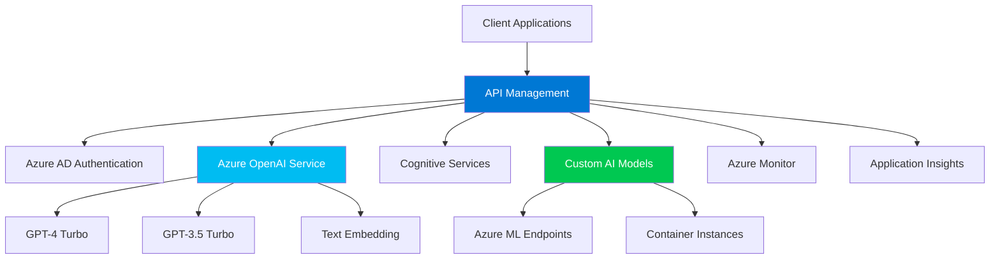

This document explains how to effectively manage API consumption using the Azure OpenAI Token Limit policy.

## Overview

Azure API Management offers a Token Limit policy, which allows you to set and monitor token consumption limits in tokens-per-minute (TPM). This helps ensure fair and efficient utilization of OpenAI resources, especially critical when dealing with sudden spikes in demand.

## Key Features

1. **Precise Control**: You can impose token-based limits on different counter keys, such as Subscription key or IP Address, tailoring the enforcement to specific use cases.

2. **Real-Time Monitoring**: The policy allows for real-time token usage monitoring, as metrics are returned from the OpenAI endpoint. This ensures accurate enforcement of limits.

3. **Pre-Calculation of Tokens**: Tokens can be pre-calculated on the Azure API Management side, preventing unnecessary requests to the OpenAI backend once limits are exceeded.

4. **Enhanced Customization**: Policies support various headers and variables such as tokens-consumed and remaining-tokens, allowing for granular control and reporting.

## Implementation Guide

### Step 1: Define Token Limits

- Determine your use case-specific limits (e.g., tokens-per-minute per Subscription key or IP Address).

### Step 2: Apply the Policy

- Implement the Token Limit policy within your API Management instance, specifying the desired limits.

### Step 3: Monitor in Real-Time

- Utilize real-time metrics to monitor token consumption and adjust settings as necessary.

### Step 4: Customize Headers and Variables

- Use customization features to adapt responses, such as including headers with usage statistics.

## Example Policy

Here is a sample policy configuration:

```xml
<policies>
    <inbound>
        <rate-limit-by-key calls="100" renewal-period="60">
            <key value="@(context.Subscription.Key)" />
            <counter-key-type>Subscription</counter-key-type>
        </rate-limit-by-key>
        <set-variable name="tokens-consumed" value="@(context.Request.TokenAmount)" />
    </inbound>
    <backend>
        <base />
    </backend>
    <outbound>
        <base />
        <set-header name="X-Tokens-Consumed" exists-action="override">
            <value>@(context.Variables["tokens-consumed"])</value>
        </set-header>
    </outbound>
    <on-error>
        <base />
    </on-error>
</policies>
```

## Best Practices

- **Adjust and Test Limits**: Regularly review and adjust token limits to align with business goals and usage patterns.
- **Integrate with Monitoring Tools**: Use external monitoring tools for enhanced observability.
- **Combine with Other Policies**: Leverage additional API Management policies such as caching or transformation for optimized performance.

## Next Steps: Working with LLMs in Azure

Now that you understand API consumption management with APIM, you can explore Azure's comprehensive AI and LLM ecosystem. Here's your roadmap for building production-ready AI applications:

### 🚀 Azure AI Foundry (Recommended Starting Point)

**Azure AI Foundry** is Microsoft's unified platform for AI development, replacing Azure AI Studio with enhanced capabilities:

- **🔗 [Azure AI Foundry Portal](https://ai.azure.com/)** - Your central hub for AI development
- **📚 [Azure AI Foundry Documentation](https://learn.microsoft.com/en-us/azure/ai-studio/)** - Complete guide and tutorials
- **🎯 Key Features**:
  - Centralized model catalog with 1,600+ models
  - No-code fine-tuning and evaluation tools
  - Built-in safety and responsible AI features
  - Integrated development environment for AI apps

### 🤖 Azure OpenAI Service Integration

Combine APIM with Azure OpenAI for enterprise-grade LLM deployments:

- **📖 [Azure OpenAI Service](https://learn.microsoft.com/en-us/azure/ai-services/openai/)** - Enterprise OpenAI with SLA guarantees
- **🔧 [Deployment Guide](https://learn.microsoft.com/en-us/azure/ai-services/openai/how-to/create-resource)** - Step-by-step setup
- **⚖️ [APIM + OpenAI Integration](https://learn.microsoft.com/en-us/azure/api-management/api-management-authenticate-authorize-azure-openai)** - Secure your AI APIs

**Key Integration Patterns**:
```xml
<!-- Example: OpenAI with APIM rate limiting -->
<policies>
    <inbound>
        <azure-openai-token-limit 
            tokens-per-minute="1000"
            counter-key="@(context.Subscription.Key)" />
        <set-backend-service 
            base-url="https://your-openai.openai.azure.com/" />
    </inbound>
</policies>
```

### 🎨 Azure AI Studio & Model Deployment

Build, test, and deploy custom AI models:

- **🏗️ [Azure AI Studio](https://ml.azure.com/)** - Machine learning workspace
- **📦 [Model Catalog](https://learn.microsoft.com/en-us/azure/machine-learning/concept-model-catalog)** - Pre-trained models from Microsoft and partners
- **🔄 [MLOps with Azure ML](https://learn.microsoft.com/en-us/azure/machine-learning/concept-ml-pipelines)** - Production ML workflows

### 🧠 Azure Cognitive Services & AI Services

Extend beyond LLMs with specialized AI capabilities:

- **👁️ [Computer Vision](https://learn.microsoft.com/en-us/azure/ai-services/computer-vision/)** - Image and video analysis
- **🗣️ [Speech Services](https://learn.microsoft.com/en-us/azure/ai-services/speech-service/)** - Text-to-speech and speech-to-text
- **🔍 [Azure AI Search](https://learn.microsoft.com/en-us/azure/search/)** - Vector search and RAG patterns
- **📝 [Document Intelligence](https://learn.microsoft.com/en-us/azure/ai-services/document-intelligence/)** - Extract insights from documents

### 🏗️ Enterprise AI Architecture Patterns

Design scalable AI solutions with APIM as your gateway:



### 🔒 Security & Governance for AI

Implement enterprise-grade security for your AI APIs:

- **🛡️ [Azure AI Content Safety](https://learn.microsoft.com/en-us/azure/ai-services/content-safety/)** - Harmful content detection
- **📋 [Responsible AI Guidelines](https://learn.microsoft.com/en-us/azure/machine-learning/concept-responsible-ai)** - Ethical AI development
- **🔐 [Private Endpoints](https://learn.microsoft.com/en-us/azure/ai-services/cognitive-services-virtual-networks)** - Secure network access
- **📊 [Cost Management](https://learn.microsoft.com/en-us/azure/ai-services/openai/how-to/manage-costs)** - Monitor and control AI spending

### 🚀 Production-Ready AI Patterns

Scale from prototype to production with these proven patterns:

1. **RAG (Retrieval-Augmented Generation)**:
   - Combine Azure AI Search + OpenAI for knowledge bases
   - [RAG Implementation Guide](https://learn.microsoft.com/en-us/azure/search/retrieval-augmented-generation-overview)

2. **Multi-Agent Systems**:
   - Orchestrate multiple AI services via APIM
   - [Semantic Kernel Integration](https://learn.microsoft.com/en-us/azure/ai-services/openai/how-to/semantic-kernel)

3. **Fine-Tuning & Custom Models**:
   - Train domain-specific models
   - [Fine-tuning Guide](https://learn.microsoft.com/en-us/azure/ai-services/openai/how-to/fine-tuning)

### 📚 Learning Path & Certifications

Continue your AI journey with structured learning:

- **🎓 [AI-900: Azure AI Fundamentals](https://learn.microsoft.com/en-us/certifications/azure-ai-fundamentals/)** - Entry-level AI certification
- **🏆 [AI-102: Azure AI Engineer](https://learn.microsoft.com/en-us/certifications/azure-ai-engineer/)** - Advanced AI implementation
- **📖 [Microsoft Learn AI Path](https://learn.microsoft.com/en-us/training/browse/?products=azure-ai-services)** - Hands-on tutorials
- **🔬 [Azure AI Samples](https://github.com/Azure-Samples/azure-ai-samples)** - Reference implementations

### 🌟 Quick Start Templates

Jump-start your AI projects with these templates:

- **🔗 [OpenAI + APIM Starter](https://github.com/Azure-Samples/openai-apim-lb)** - Load balancing multiple OpenAI endpoints
- **📝 [Chat Application Template](https://github.com/microsoft/sample-app-aoai-chatGPT)** - Full-stack chat app with Azure OpenAI
- **🔍 [Enterprise RAG Solution](https://github.com/Azure-Samples/azure-search-openai-demo)** - Complete RAG implementation
- **🏢 [Enterprise Chat](https://github.com/microsoft/PubSec-Info-Assistant)** - Government/enterprise-ready chat solution

### 💡 Community & Support

Connect with the Azure AI community:

- **💬 [Azure AI Community](https://techcommunity.microsoft.com/t5/ai-azure-ai-services/ct-p/Azure-AI-Services)** - Technical discussions and updates
- **🐛 [GitHub Issues](https://github.com/MicrosoftDocs/azure-docs/issues)** - Report documentation issues
- **📧 [Azure Support](https://azure.microsoft.com/en-us/support/options/)** - Professional support options
- **📺 [Azure AI YouTube](https://www.youtube.com/c/MicrosoftAzure)** - Latest demos and tutorials

## Conclusion

The Azure OpenAI Token Limit policy provides an effective mechanism to manage API consumption, ensuring efficient resource utilization and preventing service disruptions due to sudden demand spikes.

Combined with Azure's comprehensive AI ecosystem, you now have the foundation to build, secure, and scale enterprise-grade AI applications. Start with Azure AI Foundry for rapid prototyping, then leverage APIM for production governance and scaling.

For further details, refer to [Azure API Management Token Policies](https://learn.microsoft.com/en-gb/training/modules/api-management/4-token) and related Azure documentation.
