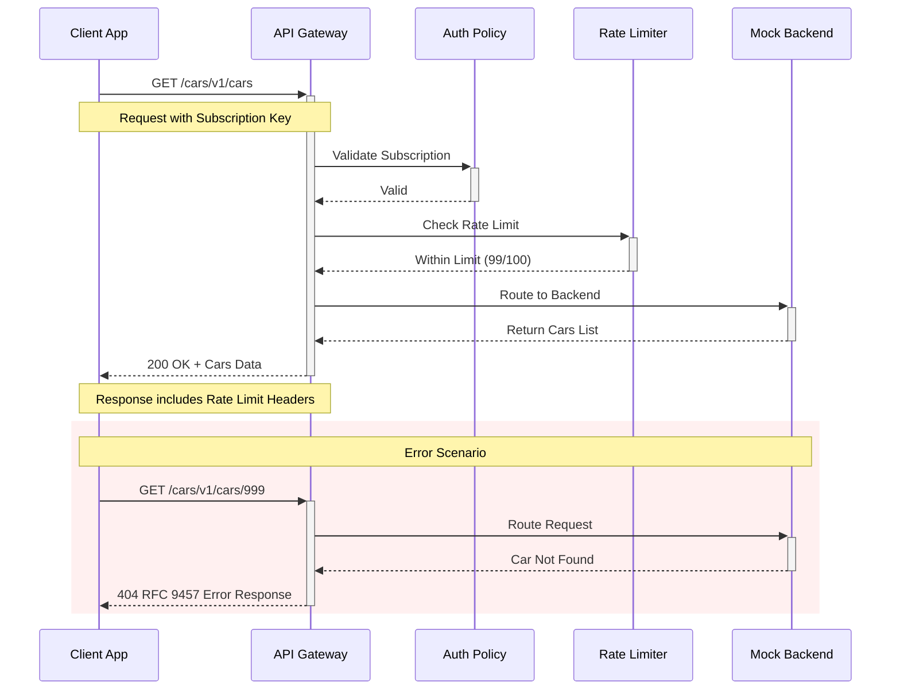

Once your API is deployed to Azure API Management, you need to test it to ensure everything works correctly. This guide covers multiple testing approaches and explains the complete request/response flow.

## API Request Flow

Understanding how requests flow through APIM helps with testing and debugging:



## Prerequisites

Before testing, ensure you have:

1. **Deployed API** - Your Cars API is deployed to APIM
2. **Subscription Keys** - Retrieved using `make get-keys`
3. **Gateway URL** - Your APIM instance gateway URL

## Method 1: Using Make Commands (Recommended)

The simplest way to test your APIs using our pre-built commands.

### Test All Cars Endpoint

```bash
make test-list-cars
```

**Expected Output:**
```json
[
  {
    "id": "1",
    "make": "Nissan",
    "model": "Skyline GT-R R34",
    "year": 1999,
    "color": "Bayside Blue",
    "driver": "Brian O'Conner",
    "movie": "2 Fast 2 Furious"
  },
  {
    "id": "2",
    "make": "Toyota",
    "model": "Supra MK4",
    "year": 1994,
    "color": "Orange",
    "driver": "Brian O'Conner",
    "movie": "The Fast and the Furious"
  }
]
HTTP Status: 200
```

### Test Single Car Endpoint

```bash
make test-get-car
```

This tests getting car with ID=1.

### Test Custom Endpoint

```bash
make test-endpoint ENDPOINT=cars/2 METHOD=GET
```

## Method 2: Direct curl Commands

For more control over your requests:

### Get All Cars

```bash
curl -X GET "https://your-apim.azure-api.net/cars/v1/cars" \
  -H "Ocp-Apim-Subscription-Key: YOUR_SUBSCRIPTION_KEY" \
  -H "Accept: application/json" \
  -w "\nHTTP Status: %{http_code}\nResponse Time: %{time_total}s\n"
```

### Get Single Car

```bash
curl -X GET "https://your-apim.azure-api.net/cars/v1/cars/1" \
  -H "Ocp-Apim-Subscription-Key: YOUR_SUBSCRIPTION_KEY" \
  -H "Accept: application/json" \
  -w "\nHTTP Status: %{http_code}\nResponse Time: %{time_total}s\n"
```

### Test Rate Limiting

```bash
# Send 105 requests quickly to trigger rate limit
for i in {1..105}; do
  curl -s -o /dev/null -w "Request $i: %{http_code}\n" \
    -H "Ocp-Apim-Subscription-Key: YOUR_SUBSCRIPTION_KEY" \
    "https://your-apim.azure-api.net/cars/v1/cars"
  sleep 0.1
done
```

After 100 requests, you should see `429 Too Many Requests`.

## Method 3: Using Postman or Insomnia

### Postman Collection Setup

1. **Create New Collection**: "APIM Cars API"
2. **Set Collection Variables**:
   - `base_url`: `https://your-apim.azure-api.net`
   - `subscription_key`: `your-subscription-key`
   - `api_path`: `cars/v1`

3. **Add Requests**:

#### Get All Cars
- **Method**: GET
- **URL**: `{{base_url}}/{{api_path}}/cars`
- **Headers**: 
  - `Ocp-Apim-Subscription-Key: {{subscription_key}}`
  - `Accept: application/json`

#### Get Single Car
- **Method**: GET  
- **URL**: `{{base_url}}/{{api_path}}/cars/1`
- **Headers**: Same as above

## Response Analysis

### Successful Response Headers

```http
HTTP/1.1 200 OK
Content-Type: application/json
X-RateLimit-Remaining: 99
X-RateLimit-Limit: 100
X-RateLimit-Reset: 60
X-Content-Type-Options: nosniff
X-Frame-Options: DENY
```

**Key Headers:**
- `X-RateLimit-*` - Rate limiting information
- `X-Content-Type-Options` - Security header
- `X-Frame-Options` - Security header

### Error Response (Rate Limited)

```http
HTTP/1.1 429 Too Many Requests
Content-Type: application/problem+json

{
  "type": "https://example.com/problems/rate-limit-exceeded",
  "title": "Rate limit exceeded",
  "status": 429,
  "detail": "You have exceeded the allowed number of requests per minute",
  "instance": "/cars/v1/cars"
}
```

### Error Response (Not Found)

```http
HTTP/1.1 404 Not Found
Content-Type: application/problem+json

{
  "type": "https://example.com/problems/car-not-found",
  "title": "Car not found",
  "status": 404,
  "detail": "The car with ID '999' was not found",
  "instance": "/cars/v1/cars/999"
}
```

## Testing Different Scenarios

### 1. Authentication Testing

#### Valid Subscription Key
```bash
curl -H "Ocp-Apim-Subscription-Key: valid-key" \
  "https://your-apim.azure-api.net/cars/v1/cars"
# Expected: 200 OK
```

#### Invalid Subscription Key
```bash
curl -H "Ocp-Apim-Subscription-Key: invalid-key" \
  "https://your-apim.azure-api.net/cars/v1/cars"
# Expected: 401 Unauthorized
```

#### Missing Subscription Key
```bash
curl "https://your-apim.azure-api.net/cars/v1/cars"
# Expected: 401 Unauthorized
```

### 2. CORS Testing

```bash
# Preflight request
curl -X OPTIONS \
  -H "Origin: https://example.com" \
  -H "Access-Control-Request-Method: GET" \
  -H "Access-Control-Request-Headers: Ocp-Apim-Subscription-Key" \
  "https://your-apim.azure-api.net/cars/v1/cars"
# Expected: 200 OK with CORS headers
```

### 3. Content Type Testing

```bash
# Request JSON
curl -H "Accept: application/json" \
  -H "Ocp-Apim-Subscription-Key: YOUR_KEY" \
  "https://your-apim.azure-api.net/cars/v1/cars"

# Request XML (should still return JSON for our API)
curl -H "Accept: application/xml" \
  -H "Ocp-Apim-Subscription-Key: YOUR_KEY" \
  "https://your-apim.azure-api.net/cars/v1/cars"
```

## Automated Testing Scripts

### Bash Health Check Script

```bash
#!/bin/bash
# health-check.sh

BASE_URL="https://your-apim.azure-api.net"
API_PATH="cars/v1"
SUBSCRIPTION_KEY="your-key"

echo "🚗 Testing Cars API Health..."

# Test 1: Get all cars
echo "Test 1: Get all cars"
response=$(curl -s -w "HTTPSTATUS:%{http_code}" \
  -H "Ocp-Apim-Subscription-Key: $SUBSCRIPTION_KEY" \
  "$BASE_URL/$API_PATH/cars")

http_code=$(echo $response | grep -o "HTTPSTATUS:[0-9]*" | cut -d: -f2)
if [ "$http_code" -eq 200 ]; then
  echo "✅ PASS: Get all cars"
else
  echo "❌ FAIL: Get all cars (HTTP $http_code)"
fi

# Test 2: Get single car
echo "Test 2: Get single car"
response=$(curl -s -w "HTTPSTATUS:%{http_code}" \
  -H "Ocp-Apim-Subscription-Key: $SUBSCRIPTION_KEY" \
  "$BASE_URL/$API_PATH/cars/1")

http_code=$(echo $response | grep -o "HTTPSTATUS:[0-9]*" | cut -d: -f2)
if [ "$http_code" -eq 200 ]; then
  echo "✅ PASS: Get single car"
else
  echo "❌ FAIL: Get single car (HTTP $http_code)"
fi

# Test 3: Non-existent car
echo "Test 3: Non-existent car"
response=$(curl -s -w "HTTPSTATUS:%{http_code}" \
  -H "Ocp-Apim-Subscription-Key: $SUBSCRIPTION_KEY" \
  "$BASE_URL/$API_PATH/cars/999")

http_code=$(echo $response | grep -o "HTTPSTATUS:[0-9]*" | cut -d: -f2)
if [ "$http_code" -eq 404 ]; then
  echo "✅ PASS: Non-existent car returns 404"
else
  echo "❌ FAIL: Non-existent car (HTTP $http_code, expected 404)"
fi

echo "Health check complete!"
```

### PowerShell Testing Script

```powershell
# test-api.ps1
$baseUrl = "https://your-apim.azure-api.net"
$apiPath = "cars/v1"
$subscriptionKey = "your-key"

$headers = @{
    "Ocp-Apim-Subscription-Key" = $subscriptionKey
    "Accept" = "application/json"
}

Write-Host "🚗 Testing Cars API..." -ForegroundColor Green

try {
    # Test get all cars
    $response = Invoke-RestMethod -Uri "$baseUrl/$apiPath/cars" -Headers $headers
    Write-Host "✅ Get all cars: Success ($($response.Count) cars found)" -ForegroundColor Green
    
    # Test get single car
    $car = Invoke-RestMethod -Uri "$baseUrl/$apiPath/cars/1" -Headers $headers
    Write-Host "✅ Get single car: Success (Car: $($car.make) $($car.model))" -ForegroundColor Green
    
} catch {
    Write-Host "❌ API Test Failed: $($_.Exception.Message)" -ForegroundColor Red
}
```

## Troubleshooting Common Issues

### Issue: 401 Unauthorized

**Causes:**
- Missing subscription key
- Invalid subscription key
- Expired subscription

**Solutions:**
```bash
# Get fresh subscription keys
make get-keys

# Verify keys in .env file
cat .env | grep APIM_PRIMARY_KEY
```

### Issue: 429 Too Many Requests

**Causes:**
- Exceeded rate limit (100 requests/minute)

**Solutions:**
```bash
# Wait for rate limit reset (60 seconds)
sleep 60

# Check rate limit headers in response
curl -I -H "Ocp-Apim-Subscription-Key: YOUR_KEY" \
  "https://your-apim.azure-api.net/cars/v1/cars"
```

### Issue: 500 Internal Server Error

**Causes:**
- Policy configuration error
- Backend service unavailable
- APIM instance issues

**Solutions:**
```bash
# Check APIM status
make check-provisioning

# Review API configuration
make show-api

# Check Azure Monitor logs (if configured)
```

### Issue: Connection Refused

**Causes:**
- Incorrect gateway URL
- Network connectivity issues
- APIM instance not running

**Solutions:**
```bash
# Verify gateway URL
az apim show --name $APIM --resource-group $RG --query "gatewayUrl" -o tsv

# Test basic connectivity
ping your-apim.azure-api.net
```

## Performance Testing

### Using OHA (Recommended)

**OHA** is a modern, fast HTTP load testing tool written in Rust. It's more accurate and feature-rich than traditional tools.

#### Install OHA

```bash
# macOS (Homebrew)
brew install oha

# Linux/Windows (Cargo)
cargo install oha

# Or download binary from GitHub releases
# https://github.com/hatoo/oha/releases
```

#### Basic Load Testing

```bash
# Test with 50 concurrent requests for 30 seconds
oha -c 50 -z 30s \
  -H "Ocp-Apim-Subscription-Key: $SUBSCRIPTION_KEY" \
  "https://your-apim.azure-api.net/cars/v1/cars"

# Test with specific number of requests
oha -n 1000 -c 20 \
  -H "Ocp-Apim-Subscription-Key: $SUBSCRIPTION_KEY" \
  "https://your-apim.azure-api.net/cars/v1/cars"

# Rate-limited testing (respect APIM limits)
oha -n 500 -q 90 \
  -H "Ocp-Apim-Subscription-Key: $SUBSCRIPTION_KEY" \
  "https://your-apim.azure-api.net/cars/v1/cars"
```

#### Advanced OHA Testing

```bash
# Test rate limiting behavior
oha -n 150 -c 10 --latency-correction \
  -H "Ocp-Apim-Subscription-Key: $SUBSCRIPTION_KEY" \
  "https://your-apim.azure-api.net/cars/v1/cars"

# JSON output for CI/CD integration
oha -n 100 -c 5 --json \
  -H "Ocp-Apim-Subscription-Key: $SUBSCRIPTION_KEY" \
  "https://your-apim.azure-api.net/cars/v1/cars" > load-test-results.json

# Test multiple endpoints
oha -n 200 -c 10 \
  -H "Ocp-Apim-Subscription-Key: $SUBSCRIPTION_KEY" \
  "https://your-apim.azure-api.net/cars/v1/cars/1"
```

#### Sample OHA Output

```
Summary:
  Success rate:	1.0000
  Total:	30.0034 secs
  Slowest:	0.2851 secs
  Fastest:	0.0123 secs
  Average:	0.0456 secs
  Requests/sec:	33.33

Response time histogram:
  0.012 [1]     |
  0.040 [789]   |■■■■■■■■■■■■■■■■■■■■■■■■■■■■■■■■■■■■■■■■
  0.067 [156]   |■■■■■■■■
  0.095 [43]    |■■
  0.122 [8]     |
  0.150 [2]     |
  0.177 [1]     |

Latency distribution:
  10% in 0.0234 secs
  25% in 0.0345 secs
  50% in 0.0423 secs
  75% in 0.0567 secs
  90% in 0.0789 secs
  95% in 0.0912 secs
  99% in 0.1234 secs
```

### Load Testing with curl (Simple)

```bash
#!/bin/bash
# Simple load test
echo "Starting load test..."
for i in {1..50}; do
  (curl -s -H "Ocp-Apim-Subscription-Key: $SUBSCRIPTION_KEY" \
    "https://your-apim.azure-api.net/cars/v1/cars" > /dev/null &)
done
wait
echo "Load test complete"
```

### Using Apache Bench (ab)

```bash
# Install apache2-utils (Ubuntu) or httpd-tools (CentOS)
sudo apt-get install apache2-utils

# Load test with 50 concurrent requests, 1000 total
ab -n 1000 -c 50 \
  -H "Ocp-Apim-Subscription-Key: YOUR_KEY" \
  "https://your-apim.azure-api.net/cars/v1/cars"
```

## Next Steps

Now that you can test your APIs effectively, continue your learning journey:

- **🔐 Secure APIs**: Implement [JWT Authentication](/how-to/configure-jwt-authentication)
- **🐛 Debug Issues**: Learn [Policy Debugging Techniques](/how-to/debug-policy-issues)
- **📊 Understand Policies**: Master [Policy Configuration](/tutorials/03-understanding-policies)
- **🚀 Production Ready**: Use the [Zero to Production Cheat Sheet](/reference/zero-to-production)

Regular testing ensures your API remains reliable and performs well under different conditions.