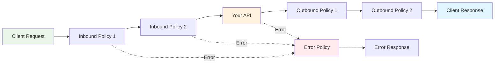

Azure API Management policies are XML configurations that transform requests and responses. This tutorial teaches you policy fundamentals through practical examples using our Cars API.

## What You'll Learn

By the end of this tutorial, you will:
- Understand how policies work in APIM
- Configure rate limiting and CORS policies
- Add security headers and error handling
- Test policy behavior with real requests
- Debug policy issues

## Prerequisites

- Completed [Provision Azure Resources](/tutorials/02-provision-azure-resources/)
- Deployed [Cars API](/guides/deploy-api/)
- Basic understanding of XML and HTTP

## Policy Fundamentals

Policies in APIM work like middleware - they process every request and response in order:



## Step 1: Examine Current Policies

Let's look at the policies already applied to our Cars API:

```bash
# View current API configuration
make show-api
```

Look for the `policies` section. You should see references to our global policy file.

```bash
# View the global policy file
cat policies/cars-api/global.xml
```

You'll see our current policy configuration with rate limiting, CORS, and security headers.

## Step 2: Understanding Rate Limiting

Our Cars API is configured with a 100 requests per minute limit. Let's test and modify this.

### Test Current Rate Limit

```bash
# Test normal usage (should work)
make test-list-cars

# Trigger rate limiting (run this several times quickly)
for i in {1..105}; do
  echo "Request $i:"
  curl -s -w "HTTP %{http_code} in %{time_total}s\n" \
    -H "Ocp-Apim-Subscription-Key: $(grep APIM_PRIMARY_KEY .env | cut -d= -f2)" \
    "https://$(grep APIM .env | cut -d= -f2).azure-api.net/cars/v1/cars" \
    -o /dev/null
  sleep 0.1
done
```

After ~100 requests, you should see `HTTP 429` responses.

### Modify Rate Limit Policy

Let's create a custom policy with different limits for learning:

```bash
# Create a backup of the original
cp policies/cars-api/global.xml policies/cars-api/global-backup.xml
```

Edit `policies/cars-api/global.xml` and find the rate-limit section:

```xml
<!-- Change from 100 to 20 requests per minute for testing -->
<rate-limit calls="20" renewal-period="60" 
           remaining-calls-header-name="X-RateLimit-Remaining"
           total-calls-header-name="X-RateLimit-Limit"
           renewal-period-header-name="X-RateLimit-Reset" />
```

Apply the updated policy:

```bash
make apply-api-policy
```

Test the new limit with OHA (recommended):

```bash
# Install OHA if not already installed
# macOS: brew install oha
# Linux/Windows: cargo install oha

# Test rate limiting with controlled load
oha -n 25 -c 1 -q 30 \
  -H "Ocp-Apim-Subscription-Key: $(grep APIM_PRIMARY_KEY .env | cut -d= -f2)" \
  "https://$(grep APIM .env | cut -d= -f2).azure-api.net/cars/v1/cars"
```

Or test with curl loop:

```bash
# This should trigger rate limiting after 20 requests
for i in {1..25}; do
  echo "Request $i:"
  curl -s -w "HTTP %{http_code}\n" \
    -H "Ocp-Apim-Subscription-Key: $(grep APIM_PRIMARY_KEY .env | cut -d= -f2)" \
    "https://$(grep APIM .env | cut -d= -f2).azure-api.net/cars/v1/cars" \
    -o /dev/null
done
```

## Step 3: Configure CORS Policies

CORS (Cross-Origin Resource Sharing) allows web browsers to make requests to your API from different domains.

### Current CORS Configuration

Look at the CORS section in `policies/cars-api/global.xml`:

```xml
<cors allow-credentials="false">
    <allowed-origins>
        <origin>*</origin>
    </allowed-origins>
    <allowed-methods>
        <method>GET</method>
        <method>POST</method>
        <method>PUT</method>
        <method>DELETE</method>
        <method>OPTIONS</method>
    </allowed-methods>
    <allowed-headers>
        <header>*</header>
    </allowed-headers>
</cors>
```

This allows all origins (`*`) - suitable for learning but not production.

### Test CORS Headers

```bash
# Test preflight request
curl -X OPTIONS \
  -H "Origin: https://example.com" \
  -H "Access-Control-Request-Method: GET" \
  -H "Access-Control-Request-Headers: Ocp-Apim-Subscription-Key" \
  -v \
  "https://$(grep APIM .env | cut -d= -f2).azure-api.net/cars/v1/cars"
```

You should see CORS headers in the response:
- `Access-Control-Allow-Origin: *`
- `Access-Control-Allow-Methods: GET,POST,PUT,DELETE,OPTIONS`

### Configure Restrictive CORS

For production, you'd want to restrict origins. Edit the CORS policy:

```xml
<cors allow-credentials="false">
    <allowed-origins>
        <origin>https://your-frontend.com</origin>
        <origin>https://localhost:3000</origin>
    </allowed-origins>
    <allowed-methods>
        <method>GET</method>
        <method>OPTIONS</method>
    </allowed-methods>
    <allowed-headers>
        <header>Authorization</header>
        <header>Content-Type</header>
        <header>Ocp-Apim-Subscription-Key</header>
    </allowed-headers>
</cors>
```

## Step 4: Security Headers

Security headers protect your API from various attacks. Let's examine and enhance them.

### Current Security Headers

Our global policy includes these security headers:

```xml
<!-- Security Headers -->
<set-header name="X-Content-Type-Options" exists-action="override">
    <value>nosniff</value>
</set-header>
<set-header name="X-Frame-Options" exists-action="override">
    <value>DENY</value>
</set-header>
<set-header name="X-XSS-Protection" exists-action="override">
    <value>1; mode=block</value>
</set-header>
```

### Test Security Headers

```bash
# Check security headers in response
curl -I \
  -H "Ocp-Apim-Subscription-Key: $(grep APIM_PRIMARY_KEY .env | cut -d= -f2)" \
  "https://$(grep APIM .env | cut -d= -f2).azure-api.net/cars/v1/cars"
```

Look for the security headers in the response.

### Add More Security Headers

Let's add additional security headers. In the outbound section of your policy, add:

```xml
<!-- Additional Security Headers -->
<set-header name="Strict-Transport-Security" exists-action="override">
    <value>max-age=31536000; includeSubDomains</value>
</set-header>
<set-header name="Content-Security-Policy" exists-action="override">
    <value>default-src 'self'</value>
</set-header>
<set-header name="Referrer-Policy" exists-action="override">
    <value>strict-origin-when-cross-origin</value>
</set-header>
```

Apply and test:

```bash
make apply-api-policy

# Test new headers
curl -I \
  -H "Ocp-Apim-Subscription-Key: $(grep APIM_PRIMARY_KEY .env | cut -d= -f2)" \
  "https://$(grep APIM .env | cut -d= -f2).azure-api.net/cars/v1/cars"
```

## Step 5: Error Handling with RFC 9457

Our API uses RFC 9457 problem details for consistent error responses.

### Test Error Responses

```bash
# Test rate limiting error (after exceeding limit)
curl -v \
  -H "Ocp-Apim-Subscription-Key: $(grep APIM_PRIMARY_KEY .env | cut -d= -f2)" \
  "https://$(grep APIM .env | cut -d= -f2).azure-api.net/cars/v1/cars"

# Test not found error
curl -v \
  -H "Ocp-Apim-Subscription-Key: $(grep APIM_PRIMARY_KEY .env | cut -d= -f2)" \
  "https://$(grep APIM .env | cut -d= -f2).azure-api.net/cars/v1/cars/999"

# Test authentication error
curl -v "https://$(grep APIM .env | cut -d= -f2).azure-api.net/cars/v1/cars"
```

Each should return a structured error response:

```json
{
  "type": "https://example.com/problems/rate-limit-exceeded",
  "title": "Rate limit exceeded",
  "status": 429,
  "detail": "You have exceeded the allowed number of requests per minute",
  "instance": "/cars/v1/cars"
}
```

### Custom Error Response

Let's add a custom error response for when the backend is unavailable. Add to the `on-error` section:

```xml
<on-error>
    <base />
    <choose>
        <when condition="@(context.LastError.Source == &quot;backend&quot;)">
            <return-response>
                <set-status code="503" reason="Service Unavailable" />
                <set-header name="Content-Type" exists-action="override">
                    <value>application/problem+json</value>
                </set-header>
                <set-body>@{
                    return JsonConvert.SerializeObject(new {
                        type = "https://example.com/problems/service-unavailable",
                        title = "Service temporarily unavailable",
                        status = 503,
                        detail = "Our cars database is temporarily unavailable. Please try again later.",
                        instance = context.Request.Url.Path
                    });
                }</set-body>
            </return-response>
        </when>
    </choose>
</on-error>
```

## Step 6: Request/Response Transformation

Let's add request logging and response transformation examples.

### Add Request Logging

In the inbound section, add logging:

```xml
<!-- Request Logging -->
<log-to-eventhub logger-id="cars-api-logger" partition-id="0">
    <message>@{
        return new JObject(
            new JProperty("timestamp", DateTime.UtcNow),
            new JProperty("method", context.Request.Method),
            new JProperty("url", context.Request.Url.ToString()),
            new JProperty("userAgent", context.Request.Headers.GetValueOrDefault("User-Agent", "")),
            new JProperty("subscriptionId", context.Subscription?.Id ?? "anonymous")
        ).ToString();
    }</message>
</log-to-eventhub>
```

### Add Response Headers

In the outbound section, add custom response headers:

```xml
<!-- Custom Response Headers -->
<set-header name="X-API-Version" exists-action="override">
    <value>v1.0</value>
</set-header>
<set-header name="X-Response-Time" exists-action="override">
    <value>@(context.Elapsed.TotalMilliseconds + "ms")</value>
</set-header>
<set-header name="X-Request-ID" exists-action="override">
    <value>@(context.RequestId)</value>
</set-header>
```

## Step 7: Testing Policy Changes

After making policy changes:

```bash
# Apply updated policies
make apply-api-policy

# Test the changes
curl -v \
  -H "Ocp-Apim-Subscription-Key: $(grep APIM_PRIMARY_KEY .env | cut -d= -f2)" \
  "https://$(grep APIM .env | cut -d= -f2).azure-api.net/cars/v1/cars"
```

Look for:
- Rate limit headers (`X-RateLimit-*`)
- Security headers
- Custom headers (`X-API-Version`, `X-Response-Time`, etc.)
- Proper error responses when limits are exceeded

## Step 8: Operation-Specific Policies

You can also apply policies to specific operations. Let's add caching to the "get single car" operation.

Create `policies/cars-api/operations/get-car-caching.xml`:

```xml
<policies>
    <inbound>
        <base />
        <!-- Cache lookup -->
        <cache-lookup vary-by-developer="false" vary-by-developer-groups="false" 
                     downstream-caching-type="none" must-revalidate="false">
            <vary-by-header>Accept</vary-by-header>
            <vary-by-query-parameter>carId</vary-by-query-parameter>
        </cache-lookup>
    </inbound>
    <backend>
        <base />
    </backend>
    <outbound>
        <base />
        <!-- Cache store for 5 minutes -->
        <cache-store duration="300" />
        <set-header name="Cache-Status" exists-action="override">
            <value>@(context.Variables.ContainsKey("cached-response") ? "HIT" : "MISS")</value>
        </set-header>
    </outbound>
    <on-error>
        <base />
    </on-error>
</policies>
```

Apply to the specific operation:

```bash
# First, get the operation ID
make list-operations

# Apply caching policy to getCarById operation
make apply-operation-policy \
  OPERATION_ID=getCarById \
  OPERATION_POLICY_FILE=policies/cars-api/operations/get-car-caching.xml
```

Test caching:

```bash
# First request (cache miss)
curl -w "Response time: %{time_total}s\n" \
  -H "Ocp-Apim-Subscription-Key: $(grep APIM_PRIMARY_KEY .env | cut -d= -f2)" \
  "https://$(grep APIM .env | cut -d= -f2).azure-api.net/cars/v1/cars/1"

# Second request (cache hit - should be faster)
curl -w "Response time: %{time_total}s\n" \
  -H "Ocp-Apim-Subscription-Key: $(grep APIM_PRIMARY_KEY .env | cut -d= -f2)" \
  "https://$(grep APIM .env | cut -d= -f2).azure-api.net/cars/v1/cars/1"
```

Look for the `Cache-Status` header to see HIT vs MISS.

## Common Policy Patterns

### 1. Conditional Logic

```xml
<choose>
    <when condition="@(context.Request.Headers.GetValueOrDefault("X-Environment") == "development")">
        <!-- Development-specific behavior -->
        <set-header name="X-Debug-Mode" exists-action="override">
            <value>true</value>
        </set-header>
    </when>
    <otherwise>
        <!-- Production behavior -->
        <set-header name="X-Debug-Mode" exists-action="override">
            <value>false</value>
        </set-header>
    </otherwise>
</choose>
```

### 2. Request Validation

```xml
<validate-content unspecified-content-type-action="prevent" 
                 max-size="1024" 
                 size-exceeded-action="prevent">
    <content type="application/json" 
             validate-as="json" 
             action="prevent" />
</validate-content>
```

### 3. Backend Routing

```xml
<choose>
    <when condition="@(context.Request.Url.Path.Contains("/v1/"))">
        <set-backend-service base-url="https://api-v1.example.com" />
    </when>
    <when condition="@(context.Request.Url.Path.Contains("/v2/"))">
        <set-backend-service base-url="https://api-v2.example.com" />
    </when>
</choose>
```

## Policy Debugging Tips

### 1. Use Trace Policies

```xml
<trace source="cars-api">
    <message>Processing request: @(context.Request.Method) @(context.Request.Url)</message>
    <metadata name="subscriptionId" value="@(context.Subscription?.Id)" />
    <metadata name="requestId" value="@(context.RequestId)" />
</trace>
```

### 2. Log Variables

```xml
<set-variable name="startTime" value="@(DateTime.UtcNow)" />
<!-- Later in outbound: -->
<trace source="cars-api">
    <message>Request completed in @(DateTime.UtcNow.Subtract((DateTime)context.Variables["startTime"]).TotalMilliseconds)ms</message>
</trace>
```

### 3. Mock Responses for Testing

```xml
<mock-response status-code="200" content-type="application/json">
    <![CDATA[{
        "debug": {
            "requestId": "@(context.RequestId)",
            "timestamp": "@(DateTime.UtcNow)",
            "subscription": "@(context.Subscription?.Id ?? "none")"
        }
    }]]>
</mock-response>
```

## Troubleshooting

### Policy Syntax Errors

```bash
# Validate XML syntax
xmllint --noout policies/cars-api/global.xml

# Check for common issues
grep -n "context\." policies/cars-api/global.xml
```

### Policy Not Applied

```bash
# Verify policy was applied
make show-api | grep -A 10 policies

# Reapply if needed
make apply-api-policy
```

### Performance Issues

```bash
# Check response times
curl -w "Time: %{time_total}s\n" \
  -H "Ocp-Apim-Subscription-Key: $(grep APIM_PRIMARY_KEY .env | cut -d= -f2)" \
  "https://$(grep APIM .env | cut -d= -f2).azure-api.net/cars/v1/cars" \
  -o /dev/null
```

## What's Next?

Congratulations! You now understand APIM policies through hands-on experience. Next steps:

1. **🔐 [Configure JWT Authentication](/how-to/configure-jwt-authentication/)** - Add proper authentication
2. **🐛 [Debug Policy Issues](/how-to/debug-policy-issues/)** - Learn advanced debugging techniques  
3. **📊 [Monitor API Performance](/how-to/monitor-api-performance/)** - Set up monitoring and alerting
4. **🏭 [Production Deployment](/tutorials/04-production-ready-apis/)** - Prepare for production

## Summary

You've learned to:
- ✅ Configure rate limiting and test limits
- ✅ Set up CORS for web applications  
- ✅ Add security headers for protection
- ✅ Handle errors with RFC 9457 format
- ✅ Apply operation-specific policies like caching
- ✅ Debug and troubleshoot policy issues

**Ready for authentication?** Continue to **[Configure JWT Authentication →](/how-to/configure-jwt-authentication)**